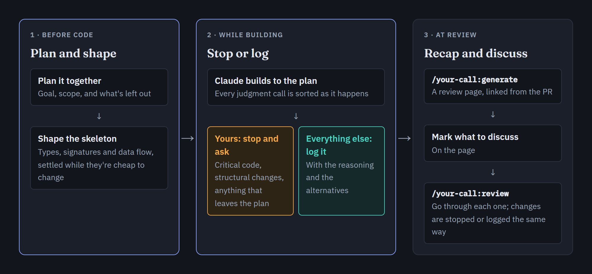
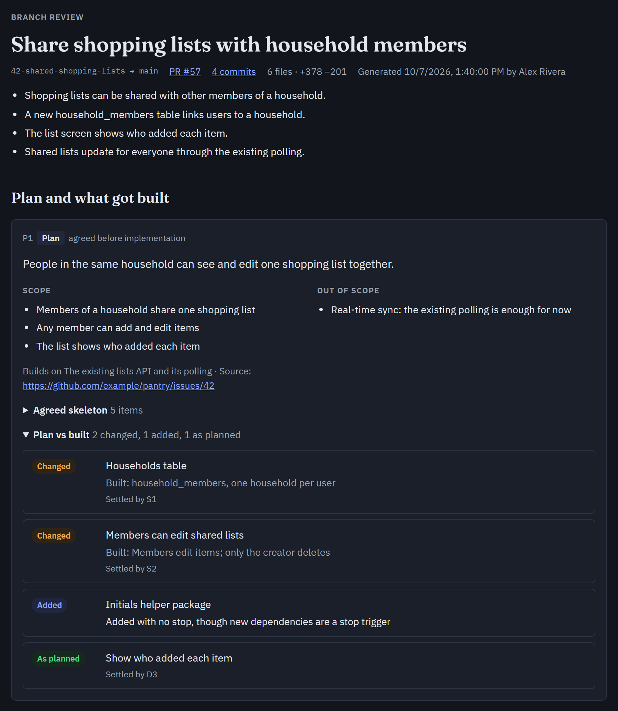
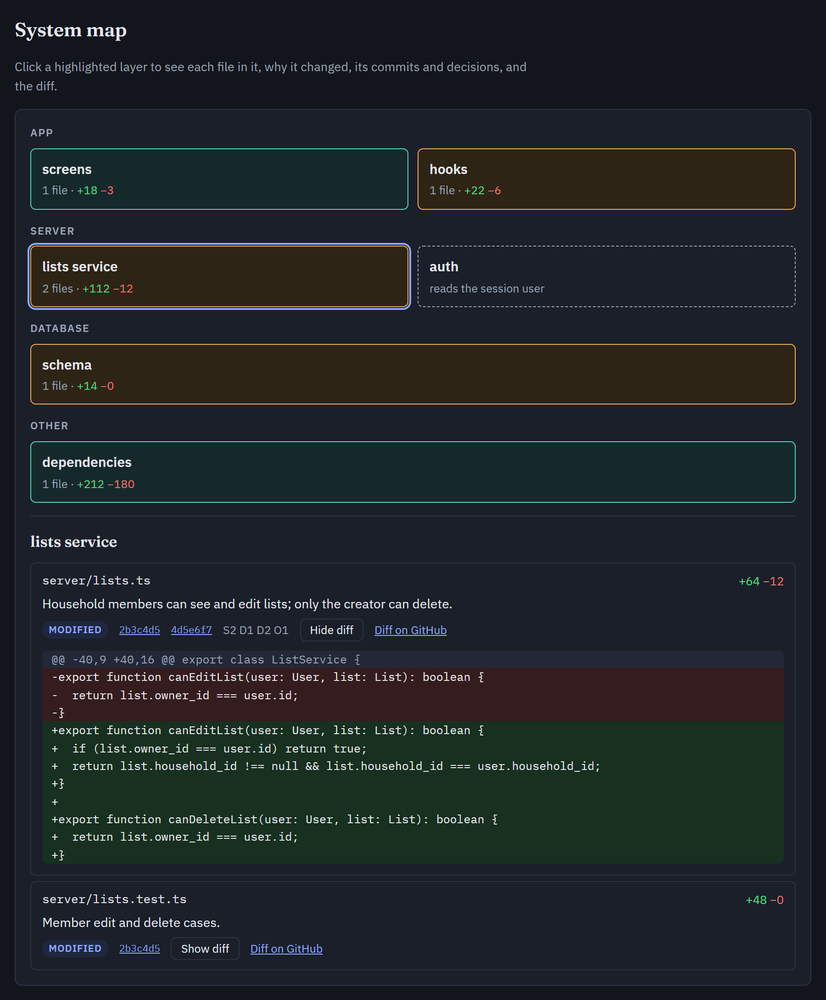
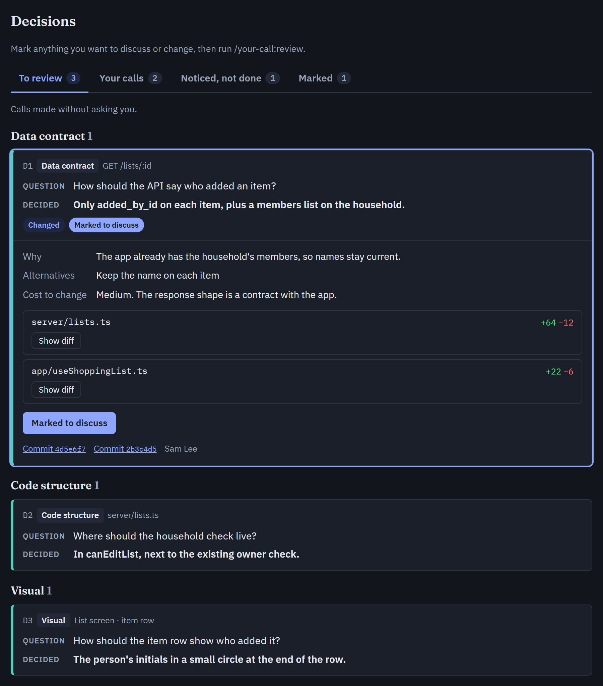

# your-call

A Claude Code plugin for staying in charge of the decisions in your code while an agent writes it, without approving every diff.



## Why

I built this because I was noticing that I was becoming the bottleneck in my workflow. Control over the decision that my agents were making was super important to me so I had rules in place preventing them from ever writing anything to any file without my approval. That was really starting to burn me out though. I felt like I was becoming an approval monkey: read diff, approve, read diff, ask for change, read new diff, approve etc. etc. After the hundredth one of the day I was getting to the point of eyes-glazed-over-rubber-stamping anything. 

The obvious fix would be to step back and only look at the finished PR. I didn't want that either. Creation is where most of the thinking happens: the plan changes, you discover things the ticket never mentioned, and small choices pile up into the shape of the code. If I only show up at the end, the agent has made all of those calls, they're already built on, and I've stopped being part of making the thing. Also in my experience (as both a dev and teacher) humans are not really good at actually reviewing stuff in detail. Waiting till the end leads to skims, misses, and mistakes.

So the goal isn't more output, or more for me to read. It's being able to see and understand what's being decided while it's being decided, and to step in on the decisions that should be mine.

Most of an agent's judgment calls are cheap and easy to undo. A few are expensive, and they should be yours to make. your-call separates them:

- The expensive decisions get made **with you, before any code exists**, while they're still cheap to change.
- While Claude builds, it **stops for the decisions that should be yours** and keeps going on the rest.
- Everything it decided on its own is **written down with its reasoning**, so at review you start from the decisions and know where to look in the diff.
- The review page is **a recap, not another pile of reading**: the calls you already made are folded away, and what's left is what you haven't seen.
- What counts as "yours" is **up to you**: the stops come from a rule file you can edit, globally or per project.

your-call doesn't replace code review. The PR, its diff and your reviewers are all still there. The review page sits next to them and adds what a diff can't show: what was decided, by whom, and why.

## How it works

### 1. Before code: plan and shape

Most of the decisions that matter are made here. This builds on Claude Code's plan mode, adding some structure to it. Before writing anything beyond a small change, Claude switches to plan mode, so no code gets written until you've agreed. If it isn't sure a task needs planning, it asks first.

In plan mode, Claude works through the plan with you: the goal, what's in scope, and what's deliberately left out. Then it proposes the **skeleton**: the new or changed types, function signatures and data shapes, and how data moves between layers. You go back and forth until you agree, then approve the plan.

The approved plan and skeleton are logged together. Questions settled while planning become part of the plan, not separate entries, so your review later isn't cluttered with things you already decided together.

### 2. While building: stop or log

As Claude builds, every judgment call goes one of two ways.

**It stops and asks you** when a decision is expensive to change or yours to make: stored data and schema, contracts other code depends on, permission checks, new dependencies, user-facing copy the plan doesn't cover, or anything that departs from the plan. It asks right away, one question at a time, with its recommendation:

```
Should the list API return each item's adder as an id or a name?

1. An id, plus the household's members (recommended): names stay current
   when someone renames themselves, and the app already loads members.
2. A name on each item: simpler for the app, but goes stale.

Trigger: a contract the app depends on.
```

**It logs everything else**, as it happens: the question, what it chose, why, the alternatives, and the cost to change. Things it notices but shouldn't fix right now are logged too, as follow-ups, not quietly done.

Your answers to stops are logged as well. That gives the branch a full record: your reviewers can see which calls you made and why, and later anyone can trace how the code got its shape, from the plan through every decision.

### 3. At review: recap and discuss

When the branch is ready, `/your-call:generate` builds a review page from the log and the diff, and links it from the PR. Mark anything you want to change, then run `/your-call:review` to go through each one with Claude. Changes made there are stopped or logged the same way.

### Make it yours

Everything Claude stops for comes from one rule file, installed by `/your-call:setup`. It's your copy, so tune it to how you work:

- **Add or remove stops.** Remove the triggers you don't care about, or add your own, like "any change under `migrations/`" or "anything touching billing".
- **Per project.** Setup can create `.claude/rules/your-call-project.md` for one repo's extra stops, committed so your whole team gets them.
- **Change what gets logged,** and how much detail goes into each entry.

When the plugin updates, running setup again shows you the changes to the default rule and lets you keep your own edits.

## Install

In Claude Code:

```
/plugin marketplace add HonestPretzels/your-call
/plugin install your-call@your-call
```

Then run setup once:

```
/your-call:setup
```

Setup installs the decision rule globally (`~/.claude/rules/`) or for one repo (`.claude/rules/`), and lists any of your existing instructions that conflict with it. The installed rule is your copy: edit it to change what Claude stops for. Run setup again after updating the plugin to merge in changes to the default rule.

## The review page

These screenshots use the sample data the page template ships with.

The plan you agreed, and how what got built compares with it:



A map of what changed, layer by layer. Open a layer to see each file, why it changed, and its diff:



The decisions, in tabs: calls Claude made without asking you, the ones you made, things it noticed but left alone, and what you've marked to discuss:



## Commands

| Command | What it does |
|---|---|
| `/your-call:setup` | Install or update the rule, and list conflicting instructions |
| `/your-call:generate` | Build or update the branch's review page and link it from the PR |
| `/your-call:review` | Work through the entries marked on the review page |

## Requirements

- Claude Code with access to published artifacts, which the review page uses
- Node.js (already installed with Claude Code)
- Git, and the GitHub CLI (`gh`) for linking pages from PRs

## Configuration

A `.your-call.json` at a repo's root can override the defaults:

```json
{
  "base": "develop",
  "skip": ["**/*.snap", "vendor/**"],
  "limits": { "fileLines": 1500, "fileBytes": 153600, "totalBytes": 2097152 }
}
```

- `base`: the branch reviews compare against, when it isn't the repo's default
- `skip`: extra paths whose diffs are never shown. Lockfiles, binaries, minified files, source maps, `dist/`, `build/` and anything `.gitattributes` marks as generated are always skipped.
- `limits`: the largest diff shown inline for one file, in changed lines and bytes, and the total for the page

## Where things live

- Decision logs: `~/.claude/your-call/logs/<repo>/<branch>.jsonl`, outside your repo. A log is deleted once its branch is merged or gone and it's two weeks stale. The review page keeps the record.
- Review pages: private claude.ai artifacts. Share one from its Share menu so reviewers can open it.

## License

MIT
