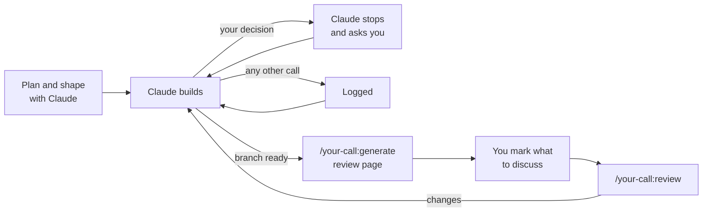

# your-call

A Claude Code plugin for staying in the loop when an agent writes your code, without approving every diff.

Approving every edit makes you the bottleneck, and after the hundredth diff it's hard not to rubber-stamp. Stepping out entirely means you stop making the decisions that shape your code. your-call keeps you in the decisions and out of the busywork:

1. **Plan and shape.** Before writing code, you and Claude agree on the work and its skeleton: the types, signatures and data flow. That's where the expensive decisions get made, while they're still cheap to change.
2. **Stop or log.** While Claude builds, it stops and asks you about decisions that are expensive to change or yours to make: schema, contracts, permissions, new dependencies, anything that departs from the plan. Every other judgment call goes in a log.
3. **Recap.** When the branch is ready, `/your-call:generate` builds a review page: the plan against what got built, a map of what changed with inline diffs, every decision with its reasoning, and how the behaviour was checked. It links the page from the PR.
4. **Discuss.** Mark anything on the page you want to talk about or change, then run `/your-call:review` to go through each one with Claude.



## The review page

These screenshots use the sample data the page template ships with.

The plan you agreed, and how what got built compares with it:


A map of what changed, layer by layer. Open a layer to see each file, why it changed, and its diff:


The decisions, in tabs: calls Claude made without asking you, the ones you made, things it noticed but left alone, and what you've marked to discuss:


## Install

In Claude Code:

```
/plugin marketplace add HonestPretzels/your-call
/plugin install your-call@your-call
```

Then run setup once:

```
/your-call:setup
```

Setup installs the decision rule globally (`~/.claude/rules/`) or for one repo (`.claude/rules/`), and lists any of your existing instructions that conflict with it. The installed rule is your copy: edit it to change what Claude stops for. Run setup again after updating the plugin to merge in changes to the default rule.

## Commands

| Command | What it does |
|---|---|
| `/your-call:setup` | Install or update the rule, and list conflicting instructions |
| `/your-call:generate` | Build or update the branch's review page and link it from the PR |
| `/your-call:review` | Work through the entries marked on the review page |

## Requirements

- Claude Code with access to published artifacts, which the review page uses
- Node.js (already installed with Claude Code)
- Git, and the GitHub CLI (`gh`) for linking pages from PRs

## Configuration

A `.your-call.json` at a repo's root can override the defaults:

```json
{
  "base": "develop",
  "skip": ["**/*.snap", "vendor/**"],
  "limits": { "fileLines": 1500, "fileBytes": 153600, "totalBytes": 2097152 }
}
```

- `base`: the branch reviews compare against, when it isn't the repo's default
- `skip`: extra paths whose diffs are never shown. Lockfiles, binaries, minified files, source maps, `dist/`, `build/` and anything `.gitattributes` marks as generated are always skipped.
- `limits`: the largest diff shown inline for one file, in changed lines and bytes, and the total for the page

## Where things live

- Decision logs: `~/.claude/your-call/logs/<repo>/<branch>.jsonl`, outside your repo. A log is deleted once its branch is merged or gone and it's two weeks stale. The review page keeps the record.
- Review pages: private claude.ai artifacts. Share one from its Share menu so reviewers can open it.

## License

MIT
